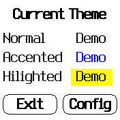
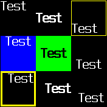
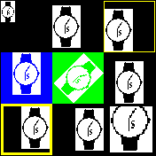
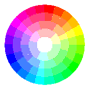

# banglejs-2-activities #

a series of studies and experiments with Bangle.js 2

The [Bangle.js 2](https://www.espruino.com/Bangle.js2) is the second iteration of a JavaScript-programmable smartwatch made available by [Espruino](https://www.espruino.com/) creator [Gordon Williams](https://github.com/gfwilliams).

This repository documents a series of studies and experiments conducted by the author in the course of developing an application for the Bangle.js 2 - looking at the discussions in the [Espruino forum](http://forum.espruino.com/microcosms/1424/), their outcome may be of interest to other people as well.

### Usage ###

Most "activities" come with some source code. Unless otherwise noted, this code may directly be loaded into the Espruino Web IDE - either for the [Bangle.js 2 emulator](https://www.espruino.com/ide/emulator.html) or for [a real device](https://www.espruino.com/ide).

> Just a small note: if you like this write-up and plan to use it, consider "starring" this repository (you will find the "Star" button on the top right of this page), so that I know which of my repositories to take most care of.

## Overview ##

A click on one of the links shown below leads directly to the corresponding topic:

### Color Handling ###

<table>
 <tr valign="top">
   <td align="center"><br><a href="#basic-colors">Basic Colors</a></td>
   <td align="center"><br><a href="#bitmap-preparation">Bitmap Preparation</a></td>
   <td align="center"><br><a href="#half-colors">"Half Colors"</a></td>
   <td align="center"><br><a href="#quarter-colors">"Quarter Colors"</a></td>
 </tr>
 <tr valign="top">
   <td align="center"><br><a href="#color-wheel">Color Wheel</a></td>
   <td align="center"><br><a href="#color-wedges">Color Wedges</a></td>
   <td align="center"><br><a href="#color-stripes">Color Stripes</a></td>
   <td align="center"><br><a href="#color-discs">Color Discs</a></td>
 </tr>
</table>

### Theming ###

<table>
 <tr valign="top">
   <td align="center"><br><a href="#theme-display">Theme Display</a></td>
   <td align="center"><br><a href="#themesetter">Theme Setter</a></td>
 </tr>
</table>

### Layouting ###

<table>
 <tr valign="top">
   <td align="center"><br><a href="#additional-concepts">additional Concepts</a></td>
   <td align="center"><br><a href="#label">Label</a></td>
   <td align="center"><br><a href="#image">Image</a></td>
   <td align="center"><br><a href="#drawable">Drawable</a></td>
 </tr>
</table>

### Analog Clock Faces ###

<table>
 <tr valign="top">
   <td align="center"><br><a href="#quarterhour-numbers">Quarter Hour Numbers</a></td>
   <td align="center"><br><a href="#hour-numbers">Hour Numbers</a></td>
   <td align="center"><br><a href="#colored-hour-numbers">colored Hour Numbers</a></td>
   <td align="center"><br><a href="#colored-hour-numbers-with-dots">colored Hour Numbers<br>with Dots</a></td>
 </tr>
 <tr valign="top">
   <td align="center"><br><a href="#hour-and-minute-hands">Hour and Minute Hands</a></td>
   <td align="center"><br><a href="#hour-minute-and-second-hands">Hour, Minute and<br>Second Hands</a></td>
   <td align="center"><br><a href="#rounded-hands">rounded Hands</a></td>
   <td align="center"><br><a href="#hollow-hands">hollow Hands</a></td>
 </tr>
</table>

### Miscellany ###

<table>
 <tr valign="top">
   <td align="center"><br><a href="#drawRoundedRect">drawRoundedRect</a></td>
   <td align="center"><br><a href="#fillRoundedRect">fillRoundedRect</a></td>
   <td align="center"><br><a href="#drawMoonPhase">drawMoonPhase</a></td>
 </tr>
</table>

## Color Handling ##

### Basic Colors ###


Because of a restriction to 3-bit colors, a Bangle.js 2 may only display 8 different colors without dithering.

The underlying [source code](Colors/BasicColors.js) for this example may be run both in the [emulator](https://www.espruino.com/ide?emulator&codeurl=https://raw.githubusercontent.com/rozek/banglejs-2-activities/main/Colors/BasicColors.js) and on a [real device](https://www.espruino.com/ide?codeurl=https://raw.githubusercontent.com/rozek/banglejs-2-activities/main/Colors/BasicColors.js).

<br clear="left">

### Bitmap Preparation ###

When it comes to preparing a bitmap for being shown on a Bangle.js 2 display, the converter built into the Web IDE's "Device Storage" manager does a remarkably good job (given the constraints it is suffering from)


However, this step also has its limitations, as shown in the following [test image](https://en.wikipedia.org/wiki/Lenna):


Flat gradients seem to cause problems, but detailed areas come out quite well.

### "Half Colors" ###

Forum user "Numerist" suggested to use RGB channel value 0.5 in addition to the natively supported values 0.0 and 1.0 in programs as the dithering algorithm built into the Bangle.js 2 seemed to produce acceptable results:


The [source code](Colors/HalfColors.js) for this example may be run both in the [emulator](https://www.espruino.com/ide?emulator&codeurl=https://raw.githubusercontent.com/rozek/banglejs-2-activities/main/Colors/HalfColors.js) and on a [real device](https://www.espruino.com/ide?codeurl=https://raw.githubusercontent.com/rozek/banglejs-2-activities/main/Colors/HalfColors.js).

Please note that increasing the color resolution (from 8 to 27) comes at a price, namely the decrease of spatial resolution. The actual resolution loss depends very much on what you draw on the screen, but it may well halve your effectively usable screen size to 88x88 pixels.

<br clear="left">

Forum user "HughB" suggested to make the color patches touchable and display the hexadecimal color code of any touched patch:


The underlying [source code](Colors/HalfColors-touchable.js) may be run both in the [emulator](https://www.espruino.com/ide?emulator&codeurl=https://raw.githubusercontent.com/rozek/banglejs-2-activities/main/Colors/HalfColors-touchable.js) and on a [real device](https://www.espruino.com/ide?codeurl=https://raw.githubusercontent.com/rozek/banglejs-2-activities/main/Colors/HalfColors-touchable.js).

Just tap on any colored patch in order to see the associated color code. Tapping outside any such patch is simply ignored. 

<br clear="left">

### "Quarter Colors" ###

While "Half Colors" still look acceptable, the next refinement step ("Quarter Colors") no longer produces good looking results:


The [source code](Colors/QuarterColors.js) for this example may be run both in the [emulator](https://www.espruino.com/ide?emulator&codeurl=https://raw.githubusercontent.com/rozek/banglejs-2-activities/main/Colors/QuarterColors.js) and on a [real device](https://www.espruino.com/ide?codeurl=https://raw.githubusercontent.com/rozek/banglejs-2-activities/main/Colors/QuarterColors.js).

<br clear="left">

### Color Wheel ###

Because of a need for a series of different colors, the author made this little "color wheel":


As usual, you may run the [source code](Colors/ColorWheel.js) both in the [emulator](https://www.espruino.com/ide?emulator&codeurl=https://raw.githubusercontent.com/rozek/banglejs-2-activities/main/Colors/ColorWheel.js) and on a [real device](https://www.espruino.com/ide?codeurl=https://raw.githubusercontent.com/rozek/banglejs-2-activities/main/Colors/ColorWheel.js).

<br clear="left">&nbsp;<br>

Again, there is also a [touchable version](Colors/ColorWheel-touchable.js) (both for the [emulator](https://www.espruino.com/ide?emulator&codeurl=https://raw.githubusercontent.com/rozek/banglejs-2-activities/main/Colors/ColorWheel-touchable.js) and a [real device](https://www.espruino.com/ide?codeurl=https://raw.githubusercontent.com/rozek/banglejs-2-activities/main/Colors/ColorWheel-touchable.js)) which displays the internal hexdecimal code of any touched color:


The whole screen is touchable:
<br>&nbsp;<br>
&nbsp; • touch outside the wheel for "black"<br>
&nbsp; • touch inside the wheel for "white"<br>
&nbsp; • touch on any segment of the wheel for the shown color.

This version also exists as a small Bangle.js 2 [application](https://rozek.github.io/BangleApps/) - just look for "ColorWheel"

<br clear="left">

### Color Wedges ###

In view of a planned application, an attempt was made to draw "intensity wedges" in various colors:


You may try yourself:<br>
&nbsp;<br>
&nbsp; • [fading to black](Colors/ColorWedge-toBlack.js), in the [emulator](https://www.espruino.com/ide?emulator&codeurl=https://raw.githubusercontent.com/rozek/banglejs-2-activities/main/Colors/ColorWedge-toBlack.js) and on a [real device](https://www.espruino.com/ide?codeurl=https://raw.githubusercontent.com/rozek/banglejs-2-activities/main/Colors/ColorWedge-toBlack.js), or<br>
&nbsp; • [fading to white](Colors/ColorWedge-toWhite.js), in the [emulator](https://www.espruino.com/ide?emulator&codeurl=https://raw.githubusercontent.com/rozek/banglejs-2-activities/main/Colors/ColorWedge-toWhite.js) and on a [real device](https://www.espruino.com/ide?codeurl=https://raw.githubusercontent.com/rozek/banglejs-2-activities/main/Colors/ColorWedge-toWhite.js)<br>
&nbsp;<br>
However, the results don't look promising at all.
<br clear="left">

In order to be able to assess the problem properly, here are the same images generated with 24-bit graphics during a conversion to 3-bit color:


As one can see, the results of the built-in dithering come pretty close to what you may expect using off-line dithering. Or, in other words, don't try to use color wedges...

### Color Stripes ###

Now that we know that we should avoid intensity gradients on a Bangle.js 2, the question arises whether we may use color gradients, at least.

Technical base for such a gradient is the function [E.HSBtoRGB](https://www.espruino.com/Reference#l_E_HSBtoRGB) which converts a given "hue" (together with a "saturation" and a "brightness") into an RGB value, that may then be used to set the current foreground color with [g.setColor](https://www.espruino.com/Reference#l_Graphics_setColor).

A description of the theory behind this conversion may be found in [Wikipedia](https://en.wikipedia.org/wiki/Hue). "Pure" colors are shown at hue angles which are multiples of 60° (i.e., 60°, 120°, 180°, ...) if angles are measured in degrees (which is the common case). In the HSB model, "black" and "white" are not counted as "colors", but may be generated by setting "brightness" or "saturation" to 0, resp.


The first example shows these "pure" colors at their corresponding angles.

You may run the [source code](Colors/ColorWheel-6Steps.js) both in the [emulator](https://www.espruino.com/ide?emulator&codeurl=https://raw.githubusercontent.com/rozek/banglejs-2-activities/main/Colors/ColorWheel-6Steps.js) and on a [real device](https://www.espruino.com/ide?codeurl=https://raw.githubusercontent.com/rozek/banglejs-2-activities/main/Colors/ColorWheel-6Steps.js).

<br clear="left">
&nbsp;<br>


The next example shows stripes of colors with hues ranging from 0 to 1 at different resolutions.

The underlying [source code](Colors/ColorStripes.js) may again be run both in the [emulator](https://www.espruino.com/ide?emulator&codeurl=https://raw.githubusercontent.com/rozek/banglejs-2-activities/main/Colors/ColorStripes.js) and on a [real device](https://www.espruino.com/ide?codeurl=https://raw.githubusercontent.com/rozek/banglejs-2-activities/main/Colors/ColorStripes.js).

The result looks surprisingly good - although you should presumably limit yourself to 24 different hue values at most (the second bottom line does so whereas the bottommost one shows 176 different hue values)

<br clear="left">


This example shows a color wheel with said 24 different hue values.

As usual, you may run the [source code](Colors/ColorWheel-24Steps.js) both in the [emulator](https://www.espruino.com/ide?emulator&codeurl=https://raw.githubusercontent.com/rozek/banglejs-2-activities/main/Colors/ColorWheel-24Steps.js) and on a [real device](https://www.espruino.com/ide?codeurl=https://raw.githubusercontent.com/rozek/banglejs-2-activities/main/Colors/ColorWheel-24Steps.js).

<br clear="left">
&nbsp;<br>

As before, here is again a similar image generated using 24-bit graphics during a conversion to 3-bit colors:


### Color Discs ###

The promising outcome of the previous experiment immediately arouses interest in further studies:


This example shows a color disc with 24 different hue and 5 different brightness values.

You may run the [source code](Colors/ColorDisc-toBlack-24+4-Steps.js) both in the [emulator](https://www.espruino.com/ide?emulator&codeurl=https://raw.githubusercontent.com/rozek/banglejs-2-activities/main/Colors/ColorDisc-toBlack-24+4-Steps.js) and on a [real device](https://www.espruino.com/ide?codeurl=https://raw.githubusercontent.com/rozek/banglejs-2-activities/main/Colors/ColorDisc-toBlack-24+4-Steps.js).

<br clear="left">
&nbsp;<br>



And here is the same with 24 different hue and 5 different saturation values.

This [source code](Colors/ColorDisc-toWhite-24+4-Steps.js) may also be run both in the [emulator](https://www.espruino.com/ide?emulator&codeurl=https://raw.githubusercontent.com/rozek/banglejs-2-activities/main/Colors/ColorDisc-toWhite-24+4-Steps.js) and on a [real device](https://www.espruino.com/ide?codeurl=https://raw.githubusercontent.com/rozek/banglejs-2-activities/main/Colors/ColorDisc-toWhite-24+4-Steps.js).

<br clear="left">
&nbsp;<br>

More than 4 gradations of brightness or saturation don't seem useful as the result of reducing brightness or saturation in smaller steps becomes increasingly unpredictable after dithering:


&nbsp; • [source code](Colors/ColorDisc-toBlack-24+8-Steps.js) for brightness example<br>
&nbsp; &nbsp; • to be run in [the emulator](https://www.espruino.com/ide?emulator&codeurl=https://raw.githubusercontent.com/rozek/banglejs-2-activities/main/Colors/ColorDisc-toBlack-24+8-Steps.js)<br>
&nbsp; &nbsp; • to be run on [a real device](https://www.espruino.com/ide?codeurl=https://raw.githubusercontent.com/rozek/banglejs-2-activities/main/Colors/ColorDisc-toBlack-24+8-Steps.js)<br>&nbsp;<br>
&nbsp; • [source code](Colors/ColorDisc-toWhite-24+8-Steps.js) for saturation example<br>
&nbsp; &nbsp; • to be run in [the emulator](https://www.espruino.com/ide?emulator&codeurl=https://raw.githubusercontent.com/rozek/banglejs-2-activities/main/Colors/ColorDisc-toWhite-24+8-Steps.js)<br>
&nbsp; &nbsp; • to be run on [a real device](https://www.espruino.com/ide?codeurl=https://raw.githubusercontent.com/rozek/banglejs-2-activities/main/Colors/ColorDisc-toWhite-24+8-Steps.js)

<br clear="left">
&nbsp;<br>

As usual, here is a similar image generated using 24-bit graphics during a conversion to 3-bit colors:


## Theming ##

In order to unify the visual appearance of multiple Bangle.js apps, users may configure a "theme" consisting of 6 different color settings.

### Theme Display ###


This example displays the currently active theme settings.

The underlying [source code](Theming/currentTheme.js) for this example may be run both in the [emulator](https://www.espruino.com/ide?emulator&codeurl=https://raw.githubusercontent.com/rozek/banglejs-2-activities/main/Theming/currentTheme.js) and on a [real device](https://www.espruino.com/ide?codeurl=https://raw.githubusercontent.com/rozek/banglejs-2-activities/main/Theming/currentTheme.js).

<br clear="left">

### ThemeSetter ###

"Theme Setter" is a small application allowing to configure the global theming of bangle.js apps (provided that these apps consider the configured theme and do not provide their own color settings)


<br clear="left">

Right now, you may find the app in [the author's personal app store](https://rozek.github.io/BangleApps/#tool) only - but soon, hopefully, in the official one as well.

The underlying sources may be found in another repository on [GitHub](https://github.com/rozek/BangleApps/tree/master/apps/themesetter).

## Layouting ##

The built-in layout library significantly simplifies the implementation of non-trivial user interfaces. It has its limitations, but these may easily be overcome with "custom renderers" and functions which generate the appropriate layout descriptions.

### Additional Concepts ###

The built-in "layout" library is really helpful when it comes to creating non-trivial user interfaces on the Bangle - but it has its limitations. Two of them are really painful:

* the set of built-in component types is rather limited - fortunately, however, you can provide your own renderers, at least
* the way of describing a user interface tends to repetitive writing down of the same settings over and over again

The controls mentioned in this section deal with these pain points in the following manner:

* "factory functions" - to be used instead of object literals - provide a more abstract and, thus, more comfortable way of describing individual components as they can hide details of their settings from the programmer
* "common settings" may be defined (once) in form of an object literal and then provided as part of a control description in a (newly introduced) `common` attribute - the "factory functions" already take care of this attribute and use them as defaults. "Common settings" may be easily cascaded (by means of `Object.assign`) and overwritten in factory functions, if need be

#### Factory Functions ####

Using factory functions is easy - as shown in the following (synthetic) example:

```
let Display = new Layout(
  Label('Test',{ bold:true })
);
Display.render();
```

Their output is nothing else but a plain JavaScript object as expected by the layout library. Most often, the `type` of such a description will be `custom` - in that case, the factory function also provides the appropriate `render` function.

The following code (taken from the "Label" component) shows a typical implementation of such a "factory function":

```
  function Label (Text, Options) {
    function renderLabel (Details) {
      let halfWidth  = Details.w/2, xAlignment = Details.halign || 0;
      let halfHeight = Details.h/2, yAlignment = Details.valign || 0;
      let Padding = Details.pad || 0;

      g.setColor(Details.col || g.theme.fg || '#000000');

      if (Details.font != null) { g.setFont(Details.font); }
      g.setFontAlign(xAlignment,yAlignment);

      let x = Details.x + halfWidth  + xAlignment*(halfWidth+Padding);
      let y = Details.y + halfHeight + yAlignment*(halfHeight+Padding);

      g.drawString(Details.label, x,y);
      if (Details.bold) {
        g.drawString(Details.label, x+1,y);
        g.drawString(Details.label, x,y+1);
        g.drawString(Details.label, x+1,y+1);
      }
    }

    let Result = Object.assign((
      Options == null ? {} : Object.assign({}, Options.common || {}, Options)
    ), {
      type:'custom', render:renderLabel, label:Text || ''
    });
      let TextMetrics;
      if (! Result.width || ! Result.height) {
        if (Result.font != null) { g.setFont(Result.font); }
        TextMetrics = g.stringMetrics(Result.label);
      }

      Result.width  = Result.width  || TextMetrics.width  + 2*(Result.pad || 0);
      Result.height = Result.height || TextMetrics.height + 2*(Result.pad || 0);
    return Result;
  }
```

It supports an `Options` argument for specific settings, takes care of "common settings" (see below), computes its minimal size and provides its own renderer.

#### Common Settings ####

"Common settings" are like style classes for HTML elements  - but stripped down and simplified for Bangle.js.

Using common settings is easy - as shown in the following (synthetic) example:

```
let StdFont = { font:'12x20' };
let legible = Object.assign({ col:'#000000', bgCol:'#FFFFFF' }, StdFont);
let Display = new Layout(
  Label('Test',{ common:commonSettings, bold:true })
);
Display.render();
```

"Common settings" are plain JavaScript objects containing attributes supported by the layout library (or "factory functions") with values that should be shared. With the help of `Object.assign`, individual settings may be cascaded and merged into new ones. Attributes specified alongside common settings have priority and override them.

#### Generic Event Dispatching ####

Some user interfaces may not expect user interaction - but most of them do. Until now, the layout library provides very little support for event handling only. The "generic event dispatching" described below solves this problem in a very lightweight way by scanning the currently active layout for the outermost control at the location of a touch (or similar) and invoking that control's handler for the event (if one is provided). In this way, every control (even labels or vertical/horizontal layouts) may react to any kind of event.

"Generic event dispatching" requires a few common functions and event-specific handler functions in any event consuming controls.

```
  let activeLayout;

/**** EventConsumerAtPoint ****/

  function EventConsumerAtPoint (HandlerName, x,y) {
    let Layout = (activeLayout || {}).l;
    if (Layout == null) { return; }

    function ConsumerIn (Control) {
      if (
        (x < Control.x) || (x >= Control.x + Control.w) ||
        (y < Control.y) || (y >= Control.y + Control.h)
      ) { return undefined; }

      if (typeof Control[HandlerName] === 'function') { return Control; }

      if (Control.c != null) {
        let ControlList = Control.c;
        for (let i = 0, l = ControlList.length; i < l; i++) {
          let Consumer = ConsumerIn(ControlList[i]);
          if (Consumer != null) { return Consumer; }
        }
      }

      return undefined;
    }

    return ConsumerIn(Layout);
  }
  
/**** dispatchTouchEvent ****/

  function dispatchTouchEvent (DefaultHandler) {
    function handleTouchEvent (Button, xy) {
      if (activeLayout == null) {
        if (typeof DefaultHandler === 'function') {
          DefaultHandler();
        }
      } else {
        let Control = EventConsumerAtPoint('onTouch', xy.x,xy.y);
        if (Control != null) {
          Control.onTouch(Control, Button, xy);
        }
      }
    }
    Bangle.on('touch',handleTouchEvent);
  }
  dispatchTouchEvent();

/**** dispatchStrokeEvent ****/

  function dispatchStrokeEvent (DefaultHandler) {
    function handleStrokeEvent (Coordinates) {
      if (activeLayout == null) {
        if (typeof DefaultHandler === 'function') {
          DefaultHandler();
        }
      } else {
        let Control = EventConsumerAtPoint('onStroke', Coordinates.xy[0],Coordinates.xy[1]);
        if (Control != null) {
          Control.onStroke(Control, Coordinates);
        }
      }
    }
    Bangle.on('stroke',handleStrokeEvent);
  }
  dispatchStrokeEvent();
```

After executing the code from above, event handling becomes really easy:

```
  let Layout = require('Layout');
  let activeLayout = new Layout({
    type:'txt', label:'Touch here', id:'Test',
      onTouch:(Control) => { print('touched "' + Control.id + '"'); }
  });
  activeLayout.render();
```

Several "screens" may be implemented by changing (and rerendering) `activeLayout` - events will always be dispatched to the currently active screen.

If you don't have a layout (because you implemented a clock with additional configuration screens - and the clock itself does not use a layout), you may provide a "default handler" for `dispatchTouchEvent` or `dispatchStrokeEvent` which is invoked instead of a control-specific event handler.

### Label ###

The built-in "txt" component does not take any `halign` and `valign` settings into account. For that reason, a simple "Label" component has been written which properly aligns text as specified.

Additionally, the component also provides a `bold` option which may be set to `true` if the given text should be shown in bold. The following screenshot illustrates both features:


• [source code](Layouting/Label.js) for the "Label" component itself<br>&nbsp;<br>
• [source code](Layouting/LabelDemo.js) for the demonstrator<br>
&nbsp; • to be run in [the emulator](https://www.espruino.com/ide?emulator&codeurl=https://raw.githubusercontent.com/rozek/banglejs-2-activities/main/Layouting/LabelDemo.js) or<br>
&nbsp; • to be run on [a real device](https://www.espruino.com/ide?codeurl=https://raw.githubusercontent.com/rozek/banglejs-2-activities/main/Layouting/LabelDemo.js)

(the demonstrator also already uses the new "common settings" feature)

<br clear="left">
&nbsp;<br>

`Label` is actually a factory function with the following signature:

```
Label(Text, Options)
```

and the following arguments:

* `Text` - contains the text to be shown
* `Options` - is an optional object containing named options (see below)

`Options` is a JavaScript object basically containing the same options you normally specify when describing a component for the layout library (including `font`, `col`, `bgCol` etc.) with the following particularities:

* `font` - optionally specifies the font to be used for rendering the given `Text`. If not explicitly given, `Label` uses the font which was configured when the factory function was invoked
* `width` - optionally specifies the requested minimum width of a label. If not explicitly defined, the width of the given `Text` is used (when rendered using the configured font)
* `height` - optionally specifies the requested minimum height of a label. If not explicitly defined, the height of the given `Text` is used (when rendered using the configured font)
* `halign` - either `-1` to left-align the given `text`, 0 to center it horizontally, or `1` to right-align it. By default, the text is centered within its layout cell
* `valign` - either `-1` to top-align the given `text`, 0 to center it vertically, or `1` to bottom-align it. By default, the text is centered within its layout cell
* `col` - optionally specifies the color in which the given text is drawn. If not explicitly defined, `Label` uses the color which was configured as the current foreground color when the factory function was invoked
* `bgCol` - optionally specifies the color with which the background of a layout cell is filled before the actual text is drawn. If not explicitly defined, the layout cell will not be filled with any color at all
* `bold` - when set to `true`, the given `Text` is shown in bold, otherwise it is drawn normally

Any unknown option is simply passed through to the layout library without further processing.

Implementation note: if `bold` is set to `true`, the given text is drawn four times - once at the original x,y coordinates, and then again with an offset of 1 pixel in any direction. This implementation is not really efficient, but produces a reasonably good looking effect independent of the currently used font.

### Image ###

The built-in "img" component only allows an image to be scaled up or down - rotation is not supported. For that reason, a simple "Image" component has been written which also allows an image to be rotated - additionally, drawing takes place within a "clipping rectangle" which prevents an image to cross the borders of its own layout cell and overlap other cells.

Last, but not least, the "Image" component also considers `halign` and `valign` settings and aligns an image properly.


• [source code](Layouting/Image.js) for the "Image" component itself<br>&nbsp;<br>
• [source code](Layouting/ImageDemo.js) for the demonstrator<br>
&nbsp; • to be run in [the emulator](https://www.espruino.com/ide?emulator&codeurl=https://raw.githubusercontent.com/rozek/banglejs-2-activities/main/Layouting/ImageDemo.js) or<br>
&nbsp; • to be run on [a real device](https://www.espruino.com/ide?codeurl=https://raw.githubusercontent.com/rozek/banglejs-2-activities/main/Layouting/ImageDemo.js)

(the demonstrator also already uses the new "common settings" feature)

<br clear="left">
&nbsp;<br>

`Image` is actually a factory function with the following signature:

```
Image(Image, Options)
```

and the following arguments:

* `Image` - contains the image to be shown (in any format supported by `g.imageMetrics` and `g.drawImage`)
* `Options` - is an optional object containing named options (see below)

`Options` is a JavaScript object basically containing the same options you normally specify when describing a component for the layout library (including `halign`, `valign`, `col`, `bgCol` etc.) with the following particularities:

* `scale` - allows the given `Image` to be scaled up or down
* `rotate` - allows the given `Image` to be rotated by the given angle (provided in radians)

Any unknown option is simply passed through to the layout library.

### Drawable ###

The built-in "img" component only allows an image to be scaled up or down - rotation is not supported. For that reason, a simple "Image" component has been written which also allows an image to be rotated.


• [source code](Layouting/Drawable.js) for the "Drawable" component itself<br>&nbsp;<br>
• [source code](Layouting/DrawableDemo.js) for the demonstrator<br>
&nbsp; • to be run in [the emulator](https://www.espruino.com/ide?emulator&codeurl=https://raw.githubusercontent.com/rozek/banglejs-2-activities/main/Layouting/DrawableDemo.js) or<br>
&nbsp; • to be run on [a real device](https://www.espruino.com/ide?codeurl=https://raw.githubusercontent.com/rozek/banglejs-2-activities/main/Layouting/DrawableDemo.js)

(the demonstrator also already uses the new "common settings" feature)

<br clear="left">
&nbsp;<br>

## Analog Clock Faces ##

At the time of this writing, there are many clock faces for the Bangle.js 2 - even analog ones - but very few (one?) that also display numbers. The following examples have been written to fill this gap.

### QuarterHour Numbers ###


• [source code](ClockFaces/QuarterHourNumbers.js) for clock face only<br>
&nbsp; • to be run in [the emulator](https://www.espruino.com/ide?emulator&codeurl=https://raw.githubusercontent.com/rozek/banglejs-2-activities/main/ClockFaces/QuarterHourNumbers.js) or<br>
&nbsp; • to be run on [a real device](https://www.espruino.com/ide?codeurl=https://raw.githubusercontent.com/rozek/banglejs-2-activities/main/ClockFaces/QuarterHourNumbers.js)<br>&nbsp;<br>
• [source code](ClockFaces/QuarterHourNumbers-with-Hands.js) for clock face and hands<br>
&nbsp; • to be run in [the emulator](https://www.espruino.com/ide?emulator&codeurl=https://raw.githubusercontent.com/rozek/banglejs-2-activities/main/ClockFaces/QuarterHourNumbers-with-Hands.js) or<br>
&nbsp; • to be run on [a real device](https://www.espruino.com/ide?codeurl=https://raw.githubusercontent.com/rozek/banglejs-2-activities/main/ClockFaces/QuarterHourNumbers-with-Hands.js)

<br clear="left">

The referenced source code considers the currently configured "theme" (and may therefore look different than shown in the screenshot on your watch depending on which theme you prefer).

A clock made with this face is perfectly readable even without backlight. If you don't need to know the seconds, you may even remove the second hand (and reduce power consumption a bit)

### Hour Numbers ###


• [source code](ClockFaces/HourNumbers.js) for clock face only<br>
&nbsp; • to be run in [the emulator](https://www.espruino.com/ide?emulator&codeurl=https://raw.githubusercontent.com/rozek/banglejs-2-activities/main/ClockFaces/HourNumbers.js) or<br>
&nbsp; • to be run on [a real device](https://www.espruino.com/ide?codeurl=https://raw.githubusercontent.com/rozek/banglejs-2-activities/main/ClockFaces/HourNumbers.js)<br>&nbsp;<br>
• [source code](ClockFaces/HourNumbers-with-Hands.js) for clock face and hands<br>
&nbsp; • to be run in [the emulator](https://www.espruino.com/ide?emulator&codeurl=https://raw.githubusercontent.com/rozek/banglejs-2-activities/main/ClockFaces/HourNumbers-with-Hands.js) or<br>
&nbsp; • to be run on [a real device](https://www.espruino.com/ide?codeurl=https://raw.githubusercontent.com/rozek/banglejs-2-activities/main/ClockFaces/HourNumbers-with-Hands.js)

<br clear="left">

The referenced source code considers the currently configured "theme" (and may therefore look different than shown in the screenshot on your watch depending on which theme you prefer).

### Colored Hour Numbers ###


• [source code](ClockFaces/coloredHourNumbers.js) for clock face only<br>
&nbsp; • to be run in [the emulator](https://www.espruino.com/ide?emulator&codeurl=https://raw.githubusercontent.com/rozek/banglejs-2-activities/main/ClockFaces/coloredHourNumbers.js) or<br>
&nbsp; • to be run on [a real device](https://www.espruino.com/ide?codeurl=https://raw.githubusercontent.com/rozek/banglejs-2-activities/main/ClockFaces/coloredHourNumbers.js)<br>&nbsp;<br>
• [source code](ClockFaces/coloredHourNumbers-with-Hands.js) for clock face and hands<br>
&nbsp; • to be run in [the emulator](https://www.espruino.com/ide?emulator&codeurl=https://raw.githubusercontent.com/rozek/banglejs-2-activities/main/ClockFaces/coloredHourNumbers-with-Hands.js) or<br>
&nbsp; • to be run on [a real device](https://www.espruino.com/ide?codeurl=https://raw.githubusercontent.com/rozek/banglejs-2-activities/main/ClockFaces/coloredHourNumbers-with-Hands.js)

<br clear="left">

The referenced source code considers the currently configured "theme" (and may therefore look different than shown in the screenshot on your watch depending on which theme you prefer).

### Colored Hour Numbers with Dots ###


• [source code](ClockFaces/coloredHourNumbers-with-Dots.js) for clock face only<br>
&nbsp; • to be run in [the emulator](https://www.espruino.com/ide?emulator&codeurl=https://raw.githubusercontent.com/rozek/banglejs-2-activities/main/ClockFaces/coloredHourNumbers-with-Dots.js) or<br>
&nbsp; • to be run on [a real device](https://www.espruino.com/ide?codeurl=https://raw.githubusercontent.com/rozek/banglejs-2-activities/main/ClockFaces/coloredHourNumbers-with-Dots.js)<br>&nbsp;<br>
• [source code](ClockFaces/coloredHourNumbers-with-Dots-and-Hands.js) for clock face and hands<br>
&nbsp; • to be run in [the emulator](https://www.espruino.com/ide?emulator&codeurl=https://raw.githubusercontent.com/rozek/banglejs-2-activities/main/ClockFaces/coloredHourNumbers-with-Dots-and-Hands.js) or<br>
&nbsp; • to be run on [a real device](https://www.espruino.com/ide?codeurl=https://raw.githubusercontent.com/rozek/banglejs-2-activities/main/ClockFaces/coloredHourNumbers-with-Dots-and-Hands.js)

<br clear="left">

The referenced source code considers the currently configured "theme" (and may therefore look different than shown in the screenshot on your watch depending on which theme you prefer).

Every analog clock needs some hands - here are code snippets for clocks with hour and minute hands and with hour, minute and second hands

### Hour and Minute Hands ###


• [source code](ClockFaces/Hour+Minute-Hands.js) for hands<br>
&nbsp; • to be run in [the emulator](https://www.espruino.com/ide?emulator&codeurl=https://raw.githubusercontent.com/rozek/banglejs-2-activities/main/ClockFaces/Hour+Minute-Hands.js) or<br>
&nbsp; • to be run on [a real device](https://www.espruino.com/ide?codeurl=https://raw.githubusercontent.com/rozek/banglejs-2-activities/main/ClockFaces/Hour+Minute-Hands.js)

<br clear="left">
&nbsp;<br>

The referenced source code considers the currently configured "theme" (and may therefore look different than shown in the screenshot on your watch depending on which theme you prefer).

### Hour, Minute and Second Hands ###


• [source code](ClockFaces/Hour+Minute+Second-Hands.js) for hands<br>
&nbsp; • to be run in [the emulator](https://www.espruino.com/ide?emulator&codeurl=https://raw.githubusercontent.com/rozek/banglejs-2-activities/main/ClockFaces/Hour+Minute+Second-Hands.js) or<br>
&nbsp; • to be run on [a real device](https://www.espruino.com/ide?codeurl=https://raw.githubusercontent.com/rozek/banglejs-2-activities/main/ClockFaces/Hour+Minute+Second-Hands.js)

If you like it minimalistic, you may even make a clock just from these hands only.

<br clear="left">
&nbsp;<br>

The referenced source code considers the currently configured "theme" (and may therefore look different than shown in the screenshot on your watch depending on which theme you prefer).

### Rounded Hands ###

At the request of user "HughB" from the [Espruino forum](http://forum.espruino.com/comments/16329708/) the author has also implemented some "rounded hands".


• [source code](ClockFaces/roundedHands.js) for hands<br>
&nbsp; • to be run in [the emulator](https://www.espruino.com/ide?emulator&codeurl=https://raw.githubusercontent.com/rozek/banglejs-2-activities/main/ClockFaces/roundedHands.js) or<br>
&nbsp; • to be run on [a real device](https://www.espruino.com/ide?codeurl=https://raw.githubusercontent.com/rozek/banglejs-2-activities/main/ClockFaces/roundedHands.js)

These hands also include a stylish "bolt" in the center.

A minimal clock with just these hands only (and no real clock face) can be found in the author's [personal app store](https://rozek.github.io/BangleApps/#clock).

<br clear="left">

The referenced source code considers the currently configured "theme" (and may therefore look different than shown in the screenshot on your watch depending on which theme you prefer).

### Hollow Hands ###

At the request of user "HughB" from the [Espruino forum](http://forum.espruino.com/comments/16329708/) the author has implemented the "hollow hands" which can be found in some mechanical watches.


• [source code](ClockFaces/hollowHands.js) for hands<br>
&nbsp; • to be run in [the emulator](https://www.espruino.com/ide?emulator&codeurl=https://raw.githubusercontent.com/rozek/banglejs-2-activities/main/ClockFaces/hollowHands.js) or<br>
&nbsp; • to be run on [a real device](https://www.espruino.com/ide?codeurl=https://raw.githubusercontent.com/rozek/banglejs-2-activities/main/ClockFaces/hollowHands.js)

These hands also include a small "bolt" in the center.

<br clear="left">
&nbsp;<br>

The referenced source code considers the currently configured "theme" (and may therefore look different than shown in the screenshot on your watch depending on which theme you prefer).

### Widget Handling ###

Since clocks are shown all the time, they should probably take care of any installed "widgets" and display them properly alogn with the clock itself. If widgets occupy the corners of a Bangle screen only, not many code changes will be necessary - otherwise, the actual clock will have to be scaled down in order to cover that part of the screen only which is guaranteed to be free of widgets.


• [source code](ClockFaces/WidgetHandling.js) for widget handling only<br>&nbsp;<br>
• [source code](ClockFaces/Dots-with-WidgetHandling.js) for the demonstrator<br>
&nbsp; • to be run in [the emulator](https://www.espruino.com/ide?emulator&codeurl=https://raw.githubusercontent.com/rozek/banglejs-2-activities/main/ClockFaces/Dots-with-WidgetHandling.js) or<br>
&nbsp; • to be run on [a real device](https://www.espruino.com/ide?codeurl=https://raw.githubusercontent.com/rozek/banglejs-2-activities/main/ClockFaces/Dots-with-WidgetHandling.js)

Please note: widget display on a dark background is not yet optimal - does anybody have an idea how to enhance it?

<br clear="left">

## Miscellany ##

### drawRoundedRect ###

The need to draw rectangles with rounded corners arose while developing an app with (customizable) buttons in its user interface. The current code was developed based on a hint at a Bresenham algorithm for circles mentioned by user "RaoulDuke" in the [Espruino forum](http://forum.espruino.com/comments/16328337/) and the discussions that followed.


• [source code](Miscellany/drawRoundedRect.js) for `drawRoundedRect` itself<br>&nbsp;<br>
• [source code](Miscellany/drawRoundedRect-Demo.js) for the demonstrator<br>
&nbsp; • to be run in [the emulator](https://www.espruino.com/ide?emulator&codeurl=https://raw.githubusercontent.com/rozek/banglejs-2-activities/main/Miscellany/drawRoundedRect-Demo.js) or<br>
&nbsp; • to be run on [a real device](https://www.espruino.com/ide?codeurl=https://raw.githubusercontent.com/rozek/banglejs-2-activities/main/Miscellany/drawRoundedRect-Demo.js)

<br clear="left">
&nbsp;<br>

`drawRoundedRect` has the signature

```
g.drawRoundedRect(x1,y1, x2,y2, r);
```

with the following arguments:

* `x1` - x coordinate of first corner
* `y1` - y coordinate of first corner
* `x2` - x coordinate of second corner (opposite the first one)
* `y2` - y coordinate of second corner (opposite the first one)
* `r` - corner radius

`r` is limited to 50% of the shorter side of the rectangle and will be reduced automatically when needed.

`drawRoundedRect` has been designed as a "polyfill" for the global graphics context `g` (and will no longer install itself as soon as Espruino provides its own method with that name) and draws the (rounded) rectangle in the current foreground color.

### fillRoundedRect ###

`fillRoundedRect` is a by-product of the `drawRoundedRect` development


• [source code](Miscellany/fillRoundedRect.js) for `fillRoundedRect` itself<br>&nbsp;<br>
• [source code](Miscellany/fillRoundedRect-Demo.js) for the demonstrator<br>
&nbsp; • to be run in [the emulator](https://www.espruino.com/ide?emulator&codeurl=https://raw.githubusercontent.com/rozek/banglejs-2-activities/main/Miscellany/fillRoundedRect-Demo.js) or<br>
&nbsp; • to be run on [a real device](https://www.espruino.com/ide?codeurl=https://raw.githubusercontent.com/rozek/banglejs-2-activities/main/Miscellany/fillRoundedRect-Demo.js)

<br clear="left">
&nbsp;<br>

`fillRoundedRect` has the signature

```
g.fillRoundedRect(x1,y1, x2,y2, r);
```

with the following arguments:

* `x1` - x coordinate of first corner
* `y1` - y coordinate of first corner
* `x2` - x coordinate of second corner (opposite the first one)
* `y2` - y coordinate of second corner (opposite the first one)
* `r` - corner radius

`r` is limited to 50% of the shorter side of the rectangle and will be reduced automatically when needed.

`fillRoundedRect` has been designed as a "polyfill" for the global graphics context `g` (and will no longer install itself as soon as Espruino provides its own method with that name) and fills the (rounded) rectangle with the current foreground color.

### drawMoonPhase ###

As a by-product of the draw/fillRoundedRect development, `drawMoonPhase` was written at a request from user "HilmarSt" in the [Espruino forum](http://forum.espruino.com/comments/16328480/).


• [source code](Miscellany/drawMoonPhase.js) for `drawMoonPhase` itself<br>&nbsp;<br>
• [source code](Miscellany/drawMoonPhase-Demo.js) for the demonstrator<br>
&nbsp; • to be run in [the emulator](https://www.espruino.com/ide?emulator&codeurl=https://raw.githubusercontent.com/rozek/banglejs-2-activities/main/Miscellany/drawMoonPhase-Demo.js) or<br>
&nbsp; • to be run on [a real device](https://www.espruino.com/ide?codeurl=https://raw.githubusercontent.com/rozek/banglejs-2-activities/main/Miscellany/drawMoonPhase-Demo.js)

<br clear="left">
&nbsp;<br>

`drawMoonPhase` has the signature

```
drawMoonPhase(CenterX,CenterY, MoonRadius, leftFactor,rightFactor);
```

with the following arguments:

* `CenterX` - x coordinate of moon center
* `CenterY` - y coordinate of moon center
* `MoonRadius` - moon radius
* `leftFactor` - is used to control the moon phase (see below)
* `rightFactor` - is used to control the moon phase (see below)

`leftFactor` and `rightFactor` are values in the range `-1.0...1.0` which control the actually shown moon phase:

* `rightFactor = 1.0` and `leftFactor` starting from `-1.0` and increasing up to `1.0` show a waxing moon
* `rightFactor = 1.0` and `leftFactor = 1.0` show a full moon
* `leftFactor = 1.0` and `rightFactor` starting from `1.0` and decreasing down to `-1.0` show a waning moon

## License ##

[MIT License](LICENSE.md)
