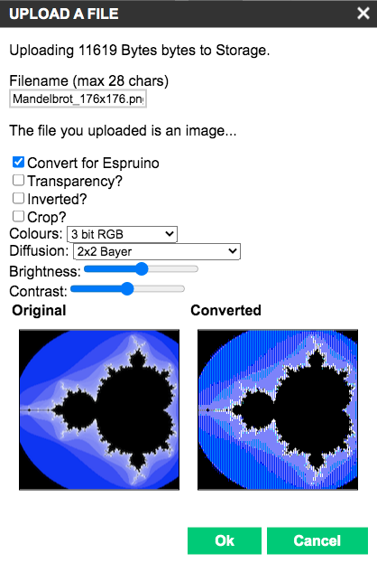

# banglejs-2-activities #

a series of studies and experiments with Bangle.js 2

The [Bangle.js 2](https://www.espruino.com/Bangle.js2) is the second iteration of a JavaScript-programmable smartwatch made available by [Espruino](https://www.espruino.com/) creator [Gordon Williams](https://github.com/gfwilliams).

This repository documents a series of studies and experiments conducted by the author in the course of developing an application for the Bangle.js 2 - looking at the discussions in the [Espruino forum](http://forum.espruino.com/microcosms/1424/), their outcome may be of interest to other people as well.

### Usage ###

Most "activities" come with some source code. Unless otherwise noted, this code may directly be loaded into the Espruino Web IDE - either for the [Bangle.js 2 emulator](https://www.espruino.com/ide/emulator.html) or for [a real device](https://www.espruino.com/ide).

> Just a small note: if you like this write-up and plan to use it, consider "starring" this repository (you will find the "Star" button on the top right of this page), so that I know which of my repositories to take most care of.

## Overview ##

### Color Handling ###

<table>
 <tr>
   <td align="center"> <a href="#basic-colors">Basic Colors</a></td>
   <td align="center"> <a href="#bitmap-preparation">Bitmap Preparation</a></td>
   <td align="center"> <a href="#half-colors">"Half Colors"</a></td>
   <td align="center"> <a href="#quarter-colors">"Quarter Colors"</a></td>
 </tr>
 <tr>
   <td align="center"> <a href="#color-wheel">Color Wheel</a></td>
   <td align="center"> <a href="#color-wedges">Color Wedges</a></td>
   <td align="center"> <a href="#color-stripes">Color Stripes</a></td>
   <td align="center"> <a href="#color-discs">Color Discs</a></td>
 </tr>
</table>

## Color Handling ##

### Basic Colors ###

Because of a restriction to 3-bit colours, a Bangle.js 2 may only display 8 different colors without dithering.

The underlying [source code](Colors/BasicColors.js) for this example may be run both in the [emulator](https://www.espruino.com/ide?emulator&codeurl=https://raw.githubusercontent.com/rozek/banglejs-2-activities/main/Colors/BasicColors.js) and on a [real device](https://www.espruino.com/ide?codeurl=https://raw.githubusercontent.com/rozek/banglejs-2-activities/main/Colors/BasicColors.js).

 

### Bitmap Preparation ###

When it comes to preparing a bitmap for being shown on a Bangle.js 2 display, the converter built into the Web IDE's "Device Storage" manager does a remarkably good job (given the constraints it is suffering from)

However, this step also has its limitations, as shown in the following [test image](https://en.wikipedia.org/wiki/Lenna):

Flat gradients seem to cause problems, but detailed areas come out quite well.

### "Half Colors" ###

Forum user "Numerist" suggested to use RGB channel value 0.5 in addition to the natively supported values 0.0 and 1.0 in programs as the dithering algorithm built into the Bangle.js 2 seemed to produce acceptable results:

The [source code](Colors/HalfColors.js) for this example may be run both in the [emulator](https://www.espruino.com/ide?emulator&codeurl=https://raw.githubusercontent.com/rozek/banglejs-2-activities/main/Colors/HalfColors.js) and on a [real device](https://www.espruino.com/ide?codeurl=https://raw.githubusercontent.com/rozek/banglejs-2-activities/main/Colors/HalfColors.js).

Please note that increasing the color resolution (from 8 to 27) comes at a price, namely the decrease of spatial resolution. The actual resolution loss depends very much on what you draw on the screen, but it may well halve your effectively usable screen size to 88x88 pixels.

 

Forum user "HughB" suggested to make the color patches touchable and display the hexadecimal color code of any touched patch:

The underlying [source code](Colors/HalfColors-touchable.js) may be run both in the [emulator](https://www.espruino.com/ide?emulator&codeurl=https://raw.githubusercontent.com/rozek/banglejs-2-activities/main/Colors/HalfColors-touchable.js) and on a [real device](https://www.espruino.com/ide?codeurl=https://raw.githubusercontent.com/rozek/banglejs-2-activities/main/Colors/HalfColors-touchable.js).

Just tap on any colored patch in order to see the associated color code. Tapping outside any such patch is simply ignored. 

 

### "Quarter Colors" ###

While "Half Colors" still look acceptable, the next refinement step ("Quarter Colors") no longer produces good looking results:

The [source code](Colors/QuarterColors.js) for this example may be run both in the [emulator](https://www.espruino.com/ide?emulator&codeurl=https://raw.githubusercontent.com/rozek/banglejs-2-activities/main/Colors/QuarterColors.js) and on a [real device](https://www.espruino.com/ide?codeurl=https://raw.githubusercontent.com/rozek/banglejs-2-activities/main/Colors/QuarterColors.js).

 

### Color Wheel ###

Because of a need for a series of different colors, the author made this little "color wheel":

As usual, you may run the [source code](Colors/ColorWheel.js) both in the [emulator](https://www.espruino.com/ide?emulator&codeurl=https://raw.githubusercontent.com/rozek/banglejs-2-activities/main/Colors/ColorWheel.js) and on a [real device](https://www.espruino.com/ide?codeurl=https://raw.githubusercontent.com/rozek/banglejs-2-activities/main/Colors/ColorWheel.js).

 &nbsp; 

Again, there is also a [touchable version](Colors/ColorWheel-touchable.js) (both for the [emulator](https://www.espruino.com/ide?emulator&codeurl=https://raw.githubusercontent.com/rozek/banglejs-2-activities/main/Colors/ColorWheel-touchable.js) and a [real device](https://www.espruino.com/ide?codeurl=https://raw.githubusercontent.com/rozek/banglejs-2-activities/main/Colors/ColorWheel-touchable.js)) which displays the internal hexdecimal code of any touched color:

The whole screen is touchable:
 &nbsp; 
&nbsp; • touch outside the wheel for "black" 
&nbsp; • touch inside the wheel for "white" 
&nbsp; • touch on any segment of the wheel for the shown color.

This version also exists as a small Bangle.js 2 [application](https://rozek.github.io/BangleApps/) - just look for "ColorWheel"

 

### Color Wedges ###

In view of a planned application, an attempt was made to draw "intensity wedges" in various colors:

You may try yourself: 
&nbsp; 
&nbsp; • [fading to black](Colors/ColorWedge-toBlack.js), in the [emulator](https://www.espruino.com/ide?emulator&codeurl=https://raw.githubusercontent.com/rozek/banglejs-2-activities/main/Colors/ColorWedge-toBlack.js) and on a [real device](https://www.espruino.com/ide?codeurl=https://raw.githubusercontent.com/rozek/banglejs-2-activities/main/Colors/ColorWedge-toBlack.js), or 
&nbsp; • [fading to white](Colors/ColorWedge-toWhite.js), in the [emulator](https://www.espruino.com/ide?emulator&codeurl=https://raw.githubusercontent.com/rozek/banglejs-2-activities/main/Colors/ColorWedge-toWhite.js) and on a [real device](https://www.espruino.com/ide?codeurl=https://raw.githubusercontent.com/rozek/banglejs-2-activities/main/Colors/ColorWedge-toWhite.js) 
&nbsp; 
However, the results don't look promising at all.
 

In order to be able to assess the problem properly, here are the same images generated with 24-bit graphics while being converted to 3-bit color:

As one can see, the results of the built-in dithering come pretty close to what you may expect using off-line dithering. Or, in other words, don't try to use color wedges...

### Color Stripes ###

Now that we know that we should avoid intensity gradients on a Bangle.js 2, the question arises whether we may use color gradients, at least.

Technical base for such a gradient is the function [E.HSBtoRGB](https://www.espruino.com/Reference#l_E_HSBtoRGB) which converts a given "hue" (together with a "saturation" and a "brightness") into an RGB value, that may then be used to set the current foreground color with [g.setColor](https://www.espruino.com/Reference#l_Graphics_setColor).

A description of the theory behind this conversion may be found in [Wikipedia](https://en.wikipedia.org/wiki/Hue). "Pure" colors are shown at hue angles which are multiples of 60° (i.e., 60°, 120°, 180°, ...) if angles are measured in degrees (which is the common case). In the HSB model, "black" and "white" are not counted as "colors", but may be generated by setting "brightness" or "saturation" to 0, resp.

The first example shows these "pure" colors at their corresponding angles.

You may run the [source code](Colors/ColorWheel-6Steps.js) both in the [emulator](https://www.espruino.com/ide?emulator&codeurl=https://raw.githubusercontent.com/rozek/banglejs-2-activities/main/Colors/ColorWheel-6Steps.js) and on a [real device](https://www.espruino.com/ide?codeurl=https://raw.githubusercontent.com/rozek/banglejs-2-activities/main/Colors/ColorWheel-6Steps.js).

 
&nbsp; 

The next example shows stripes of colors with hues ranging from 0 to 1 at different resolutions.

The underlying [source code](Colors/ColorStripes.js) may again be run both in the [emulator](https://www.espruino.com/ide?emulator&codeurl=https://raw.githubusercontent.com/rozek/banglejs-2-activities/main/Colors/ColorStripes.js) and on a [real device](https://www.espruino.com/ide?codeurl=https://raw.githubusercontent.com/rozek/banglejs-2-activities/main/Colors/ColorStripes.js).

The result looks surprisingly good - although you should presumably limit yourself to 24 different hue values at most (the second bottom line does so whereas the bottommost one shows 176 different hue values)

 

This example shows a color wheel with said 24 different hue values.

As usual, you may run the [source code](Colors/ColorWheel-24Steps.js) both in the [emulator](https://www.espruino.com/ide?emulator&codeurl=https://raw.githubusercontent.com/rozek/banglejs-2-activities/main/Colors/ColorWheel-24Steps.js) and on a [real device](https://www.espruino.com/ide?codeurl=https://raw.githubusercontent.com/rozek/banglejs-2-activities/main/Colors/ColorWheel-24Steps.js).

 
&nbsp; 

As before, here is again a similar image generated using 24-bit graphics while being converted to 3-bit colors:

### Color Discs ###

This promising outcome of the previous experiment arouses interest in further studies:

This example shows a color disc with 24 different hue and 4 different brightness values.

You may run the [source code](Colors/ColorDisc-24-4Steps.js) both in the [emulator](https://www.espruino.com/ide?emulator&codeurl=https://raw.githubusercontent.com/rozek/banglejs-2-activities/main/Colors/ColorDisc-24-4Steps.js) and on a [real device](https://www.espruino.com/ide?codeurl=https://raw.githubusercontent.com/rozek/banglejs-2-activities/main/Colors/ColorDisc-24-4Steps.js).

 
&nbsp; 

As usual, here is a similar image generated using 24-bit graphics while being converted to 3-bit colors:

## License ##

[MIT License](LICENSE.md)
